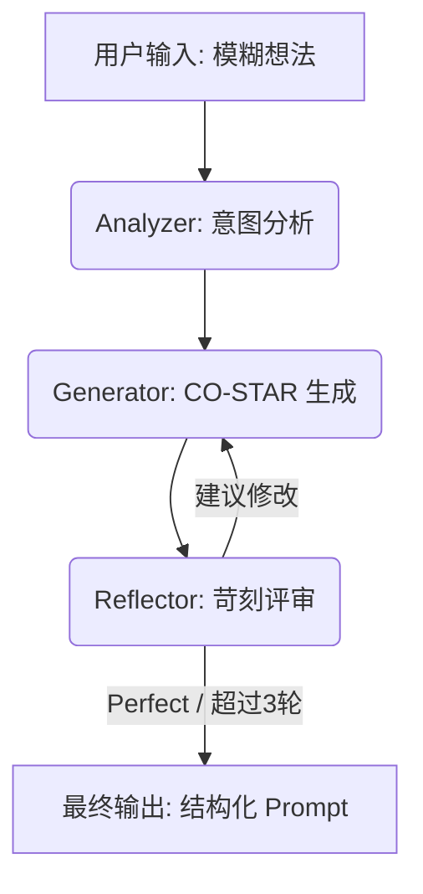

# Prompt智能体：基于 Reflexion 模式的自动化提示词工程系统

**分享主题**: 提示词工程（Prompt Engineering）的自动化与 Agent 化实践  
**分享时间**: 2026 年 1 月  
**技术栈**: LangGraph + Reflexion + Vue 3
**版本**: 1.0.0
---

## 📋 目录

1. [背景与挑战](#背景与挑战)
2. [核心理念：提示词即工程](#核心理念提示词即工程)
3. [系统架构设计](#系统架构设计)
4. [核心工作流 (Reflexion)](#核心工作流-reflexion)
5. [技术亮点](#技术亮点)
6. [关键功能详解](#关键功能详解)
7. [交互设计：SSE 全流式体验](#交互设计sse-全流式体验)
8. [部署与配置](#部署与配置)
9. [未来展望](#未来展望)

---

## 背景与挑战

### 💥 提示词工程的痛点

随着大模型（LLM）在业务中的深度集成，编写高质量的提示词（Prompt）已成为核心生产力，但开发者面临以下挑战：

#### 1. **“抽卡式”调优 (Trial and Error)**
- 用户往往只给出模糊的指令（如“帮我写个前端组件”）。
- 输出质量全看模型“运气”，缺乏确定性。
- 开发者需要手动进行数十轮测试，效率低下。

#### 2. **结构化缺失**
- 优秀的提示词需要包含角色、上下文、目标、约束等多个维度（如 CO-STAR 原则）。
- 普通用户难以掌握复杂的提示词框架，导致模型输出容易产生幻觉或逻辑断层。

#### 3. **反馈闭环滞后**
- 用户不知道提示词哪里写得不好，只有看到错误结果后才知道去修改。
- 缺乏一个“苛刻的评审员”在生成前进行拦截和修正。

---

## 核心理念：提示词即工程

### 🤖 自动化 Prompt 优化 Agent

我们将提示词的产生过程从“一次性输入”转变为“多智能体迭代”。

| 创新点 | 传统方式 |  Agent 方案 | 优势 |
| :--- | :--- | :--- | :--- |
| **构建逻辑** | 凭感觉写 | **CO-STAR 框架自动注入** | 专业性强，覆盖所有边界 |
| **优化过程** | 人工反复修改 | **Reflexion (反思) 自动迭代** | 自动进化，直至达到 Perfect |
| **意图识别** | 直接传给模型 | **架构师级意图拆解** | 挖掘隐藏需求，补全缺失上下文 |
| **交互感知** | 等待结果返回 | **SSE 过程+Token 双流展示** | “所见即所得”，消除黑盒感 |

---

## 系统架构设计

### 系统组成

项目采用前后端分离架构，核心逻辑由 LangGraph 驱动。

```text
prompt_agent/
├── backend/                # Python 后端 (大脑)
│   ├── agent/              # LangGraph 工作流实现
│   │   ├── nodes.py        # 节点逻辑 (Analyzer, Generator, Reflector)
│   │   └── graph.py        # 图拓扑结构定义
│   └── main.py             # SSE 异步接口服务
└── frontend/               # Vue 3 前端 (感知)
    ├── src/
    │   ├── useSSE.js       # 全异步事件流控制器
    │   └── App.vue         # 响应式交互面板
```

### 逻辑分层



---

## 核心工作流 (Reflexion)

本系统采用 **Reflexion (反思)** 模式，而不只是简单的线性 Chain。

### 1️⃣ Analyzer Node (意图分析)
- **任务**：扮演“资深架构师”。
- **目标**：识别核心意图、目标受众、预期格式，并挑出模糊的上下文。
- **输出**：深度需求分析报告。

### 2️⃣ Generator Node (生成/优化)
- **任务**：扮演“顶级 Prompt 工程师”。
- **框架**：强制遵循 **CO-STAR** 原则 (Context, Objective, Style, Tone, Audience, Response)。
- **约束**：Payload Only（只输出提示词正文，无废话）。

### 3️⃣ Reflector Node (反思/评审)
- **任务**：扮演“极度挑剔的评审专家”。
- **逻辑**：寻找任何细微的改进空间（幻觉风险、约束力不足等）。
- **出口**：只有通过评审或达到迭代上限（3轮）才结束。

---

## 技术亮点

### 1️⃣ **异步 astream_events 架构**
为了解决传统 Web 接口在长耗时任务中的阻塞问题，系统全面采用异步驱动：
- **后端**：利用 LangGraph 的 `astream_events` 实时捕捉节点启动、Token 吐字、节点结束等精细化事件。
- **性能**：完全不阻塞 FastAPI 的 Event Loop，支持高并发处理。

### 2️⃣ **SSE 双流通信协议**
我们重新定义了前端感知 AI 思考的方式：
- **状态流**：实时同步中间思考过程（意图分析中 -> 评审中）。
- **Token 流**：优化后的提示词以 0 延迟的打字机效果呈现。

### 3️⃣ **结构化输出约束**
通过在节点 Prompt 中注入严格的格式约束，确保生成的提示词：
- 直接可用于生产环境。
- 包含清晰的 Markdown 标题和代码块。
- 具备高度的可复制性。

### 4️⃣ **持久化记忆与历史追溯**
引入 **PostgreSQL** 异步存储架构：
- **全量记录**：系统实时保存每一轮会话的原始输入、意图分析、优化结果及反思建议。
- **断点续传能力**：即便优化过程中断，历史记录仍可追溯，为后续“从断点继续优化”提供了底层数据支持。
- **审计与分析**：支持对历史提示词的演进过程进行回溯，帮助用户分析提示词的迭代逻辑。

### 5️⃣ **轻量级本地 RAG 知识注入**
引入基于语义检索的增强生成能力：
- **语义匹配**：利用 `text2vec-base-chinese` 本地模型，将用户意图与企业知识库进行向量匹配。
- **行业基准**：自动检索行业标准提示词模板（如日报、Vue 组件规范等），强制 Generator 节点遵循，确保输出高度符合行业/企业标准。
- **极致性能**：基于 FAISS CPU 版索引，检索过程在毫秒级完成，且无需依赖外部收费检索服务。

---

## 交互设计：SSE 全流式体验

为了提升“Vibe Coding”的爽感，前端实现了三段式反馈：

1.  **即时响应**：点击按钮后，中间时间轴立即点亮“🔵 等待中”指示灯。
2.  **RAG 视觉介入**：当检测到知识库命中时，时间轴图标动态变为紫色 `Collection` 标识，并弹出带有“企业知识库已介入”标识的独立知识卡片，增强用户对系统能力的感知。
3.  **深度思考动画**：在 LLM 构思期间，右侧面板展示骨架屏及“AI 正在深度思考”动态提示。
3.  **渐进式渲染**：
    -   **Analyzer/Reflector**：完成后控制台同步输出详细日志。
    -   **Generator**：进入输出阶段，指示灯转为“🟢 正在输出”，文字逐字蹦出。

---

## 部署与配置

### 环境要求
- Python 3.10+
- Node.js 18+
- DeepSeek API Key

### 快速启动
1.  **后端**：
    ```bash
    cd backend
    pip install -r requirements.txt
    python main.py
    ```
2.  **前端**：
    ```bash
    cd frontend
    npm install
    npm run dev
    ```

---

## 未来展望

### 🚀 2.0 规划
1.  **一键试运行 (One-Click Run)**：在右侧增加预览按钮，直接调用 LLM 运行生成的 Prompt 并展示结果。
2.  **知识库可视化编辑器**：提供 GUI 界面，允许管理人员直接在页面上增删改 `templates.json` 中的知识点。
3.  **多模型竞技场**：同时生成不同模型（GPT-4 vs DeepSeek）优化后的结果，供用户对比。

---

## 总结

Prompt智能体不仅仅是一个优化工具，它是**提示词工程自动化**的一次标准化实践。通过将“思考-生成-反思”这一人类专家的思维过程模型化，它极大地降低了大语言模型的使用门槛，让每一个普通用户都能产出专业级的提示词。

---

## 联系方式

**项目地址**: `http://172.16.0.227:8888/ai/prompt_agent`
**版本**: 1.0.0  
**最后更新**: 2026-01-24  
**维护人**: 云服务中心-王毅涛

---
